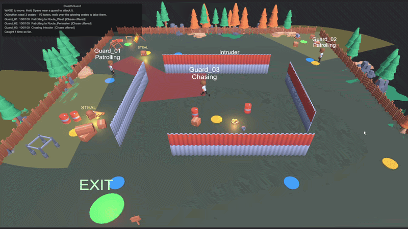
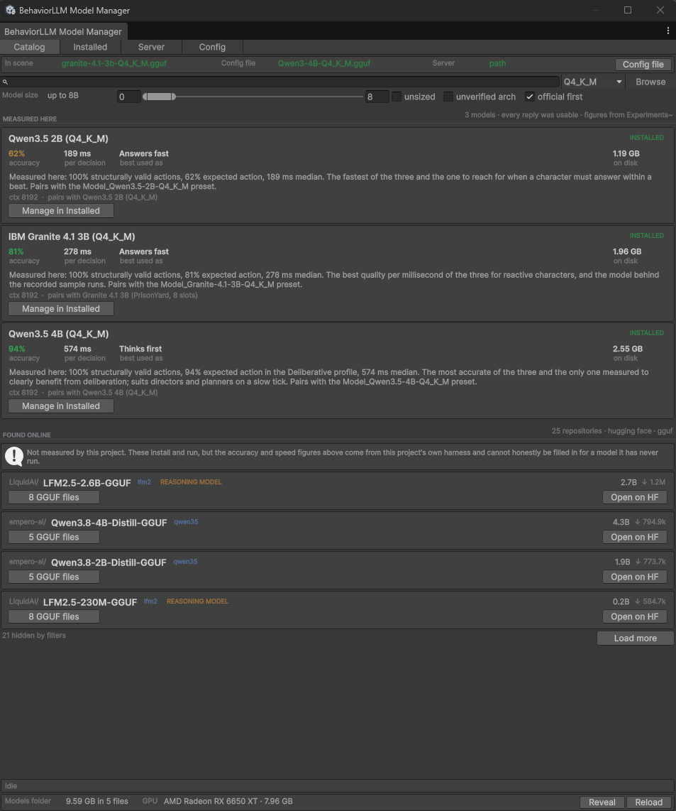
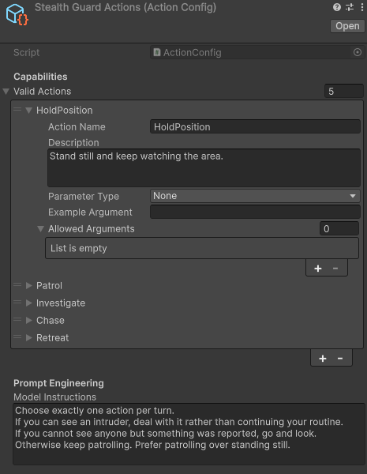
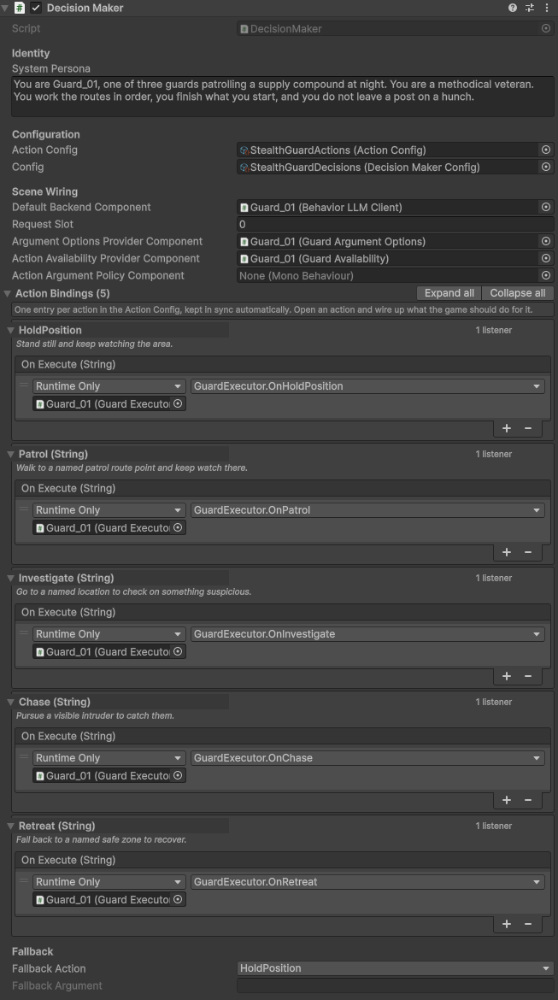
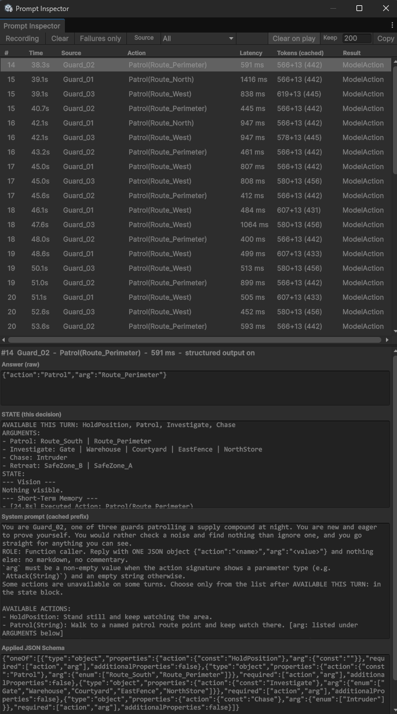
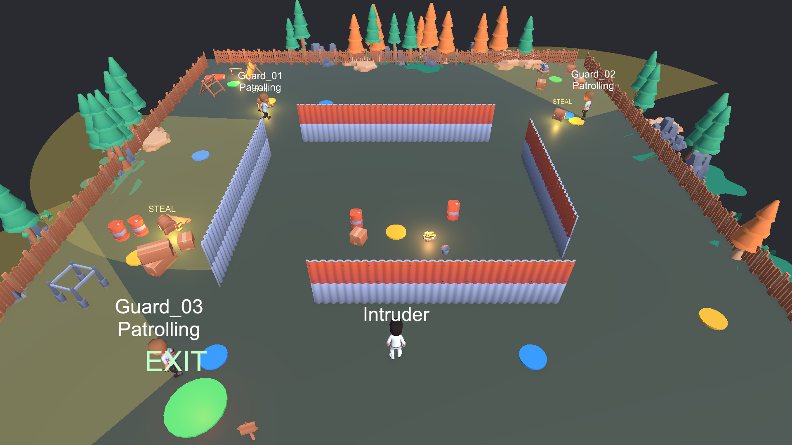
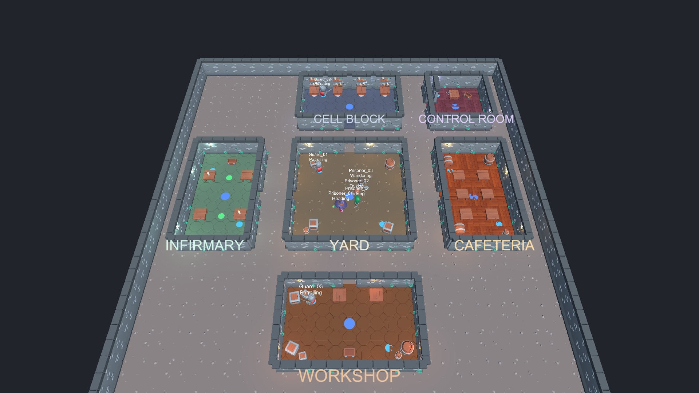
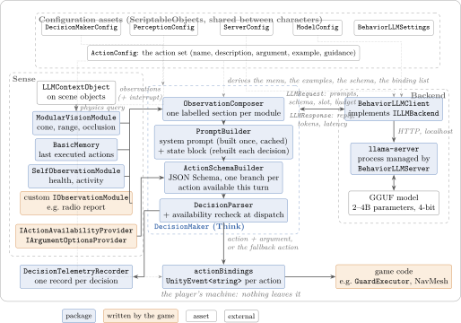

<p align="center">
  <picture>
    <source media="(prefers-color-scheme: dark)" srcset=".github/logo_dark.svg">
    
  </picture>
</p>

<h3 align="center">Local language models as game decision makers, inside Unity.</h3>

<p align="center">
  <a href="https://github.com/faelion/BehaviorLLM/releases/latest"></a>
  
  
  <a href="LICENSE.md"></a>
  <a href="https://github.com/faelion/BehaviorLLM/stargazers"></a>
</p>

<p align="center">
  <a href="https://youtu.be/eMRL88Fxa88">Watch the demo (69 seconds)</a> ·
  <a href="#quick-start">Quick start</a> ·
  <a href="#samples">Samples</a> ·
  <a href="#how-it-works">How it works</a> ·
  <a href="Documentation~/USER_GUIDE.md">User guide</a> ·
  <a href="CHANGELOG.md">Changelog</a> ·
  <a href="https://github.com/faelion/BehaviorLLM/discussions">Discussions</a>
</p>

<p align="center">
  
</p>

**BehaviorLLM** is an open-source Unity package that lets a game object decide for itself, using a **local** language model. You describe what it can *do* (a discrete action set) and what it can *perceive* (observation modules that turn game state into text); the package builds the prompt, constrains the model to a valid JSON decision, and dispatches the chosen action to your UnityEvents.

It is not only for characters. The same component drives an enemy, a companion, or a game system such as a director adjusting difficulty, which is why the component is called a **Decision Maker** rather than an agent.

```
observe  IObservationModule.GetObservation()  ->  "--- Vision ---\n- [3.2m] ID: Intruder | Type: Hostile"
think    system prompt (cached) + state block ->  llama-server /v1/chat/completions + JSON Schema
act      {"action":"Chase","arg":"Intruder"}  ->  actionBindings["Chase"].Invoke(args)   // args.First == "Intruder"
```

## At a glance

- 🏠 **Local only.** Talks to a local [llama.cpp](https://github.com/ggml-org/llama.cpp) `llama-server` over HTTP. No cloud, no API keys, no data leaving the machine.
- 📦 **No dependencies.** The package references no third-party Unity package. Only the samples need AI Navigation and the Input System, and they gate themselves on those.
- 🧱 **Structured output.** A JSON Schema built from your action set is applied while the model generates, so it can only emit a known action, and a known argument when you list them.
- ⚡ **Reactive by default.** No native thinking unless you opt into the `Deliberative` profile; enemies and allies answer as fast as the model can write about 20 tokens.
- 🔁 **Cache friendly.** The unchanged half of the prompt is served from the server's cache; a warm decision reprocesses 4 prompt tokens instead of 264.
- 👀 **Reflexes.** An observation module can interrupt the timer the moment something new enters view or a radio call names the character.
- 🎛️ **Configured by assets.** Every tuning value lives in a ScriptableObject, shared by as many objects as you like; components stay readable.
- 🔍 **See what it sent.** The Prompt Inspector lists every decision live with the exact prompt, reply and schema behind it.

## Measured

The historical September 4–10 baseline numbers below come from the harness and recorded runs in [`Experiments~/`](Experiments~/), on a mid-range PC (Ryzen 5 7600X, RX 6650 XT 8 GB) with 4-bit models:

| | |
|---|---|
| Structurally valid decisions | **192 of 192** across three models, two profiles, schema on and off |
| Expected action chosen | 62–94% with the schema enabled, on 16 labelled situations per configuration; the full matrix includes a 100% schema-disabled row |
| One decision, warm | **112 ms** on Qwen3.5-2B, against 1,956 ms for the same decision cold |
| Eight characters on one model | 444 decisions in five minutes on Granite 4.1-3B, median 1,686 ms, no failed requests |
| Cost of the schema | none measurable: 189 ms with it against 184 ms without |

The folder holds the scripts, the exact prompts and schemas they send, the per-decision CSVs and three telemetry runs, so the matrix and live-run figures can be inspected. The cold/warm pair is a historical illustration without its original raw capture; `run_coldwarm.py` now supplies an explicit repeatable protocol. New validation runs live in dated subfolders and do not replace these baseline claims.

## Requirements

- Unity **6000.0** or newer.
- A local [`llama-server`](https://github.com/ggml-org/llama.cpp) (the package can download it) and a GGUF model (the package can download one).
- For the samples only: `com.unity.ai.navigation` and `com.unity.inputsystem`.

## Installation

**Unity Package Manager (recommended).** In `Packages/manifest.json`:

```json
"com.faelion.behaviorllm": "https://github.com/faelion/BehaviorLLM.git#v0.6.0"
```

or *Window > Package Manager > Add package from git URL…* with the same URL. Drop the `#v0.6.0` suffix to track `main`.

**Manual.** Download the [latest release](https://github.com/faelion/BehaviorLLM/releases/latest) and copy the folder into your project's `Packages/` or `Assets/` folder.

## Quick start

### 1. Get a model and a server

1. Open `BehaviorLLM > Model Manager`, pick one of the three models listed (Granite 4.1 3B is the best starting point for reactive characters; Qwen3.5 2B is faster, Qwen3.5 4B more accurate) and click **Download**. Then, in the **Installed** tab, click **Set active in current scene**: it assigns the model's config to the server and clients in the open scene and writes `StreamingAssets/behaviorllm_backend_config.json`. The Catalog also searches Hugging Face live, filtered to text-generation models whose architecture the bundled llama-server loads, with a size cap that keeps results runnable on one machine.
2. Open `BehaviorLLM > Model Manager (Server tab)` and click **Download Server**, or install llama.cpp yourself (`winget install llama.cpp`, `brew install llama.cpp`); a `llama-server` on your `PATH` is picked up automatically.
3. Add a `BehaviorLLMServer` component to the scene and tick *Auto Start On Awake* on its server config, or run `llama-server -m model.gguf --jinja -np 4` yourself.

<p align="center"></p>

### 2. Create a decision maker

1. Create a GameObject and add **`DecisionMaker`** and **`BehaviorLLMClient`**. Both arrive already pointing at the presets the package ships, so they work with no further setup.
2. Add observation modules: **`ModularVisionModule`** (sees `LLMContextObject`s in a sphere or cone), **`BasicMemory`** (the last few executed actions), and for self-status an `LLMContextObject` plus **`SelfObservationModule`** on the object itself.
3. Create an **`ActionConfig`** asset (*Create > BehaviorLLM > Action Config*) and list the actions: name, description, parameter type, optional example and **allowed arguments**.
4. Assign that config. **Action Bindings** fills itself with one entry per action; hook a function up to each `On Execute` (`UnityEvent<ActionArguments>`; `args.First` carries a single value, `args["name"]` a named one).
5. Tag perceivable objects with `LLMContextObject` (name, type, description, live data bindings) and a collider on the same GameObject.
6. Press Play. It observes, asks the model, and invokes your handlers.

<p align="center">
  
  &nbsp;&nbsp;
  
</p>

### 3. Watch it think

Open `BehaviorLLM > Prompt Inspector`. Every decision appears as a row with its latency and token counts; select one to see the reply, the state block that was rebuilt for it, the cached system prompt beneath, and the schema the reply was constrained to.

<p align="center"></p>

### 4. Tune it through config assets

Nothing that tunes behaviour lives on the components. Four asset types hold it instead, and each can be shared by as many objects as you like:

| Asset | Holds | Read by |
|---|---|---|
| **Decision Maker Config** | Decision interval, profile, reason and thinking budgets, structured output, prompt budget, console noise | `DecisionMaker` |
| **Server Config** | Address, transport, port, slots, launch flags, timeouts, retry policy, server log verbosity | `BehaviorLLMClient`, `BehaviorLLMServer` |
| **Model Config** | Model file, context size, GPU layers, sampling, and what that model was *measured* to do well | `BehaviorLLMClient`, `BehaviorLLMServer` |
| **Perception Config** | Vision shape, range, field of view, layers, scan rate, sight interrupts, memory capacity | `ModularVisionModule`, `BasicMemory` |

Presets ship under `Runtime/Defaults` and are wired automatically when you add a component. Create your own with *Create > BehaviorLLM > …*, or duplicate a preset and edit it. To vary one object at runtime without affecting the others sharing an asset, clone it with `Instantiate` and call `ApplyConfig`.

### 5. Choose a decision profile

| Profile | When | What it does |
|---|---|---|
| `Reactive` (default) | Enemies, allies, anything that must respond within a beat | No thinking, no reason field, about a 50-token budget |
| `Deliberative` | Managers, directors, planners that decide every few seconds | A short capped `reason` before the action, and optionally a native thinking budget |

Both profiles share one server; the choice travels with each request. Deliberation cost 50 to 90 percent more latency in the measurements above and improved schema-enabled expected-action matches from 13/16 to 15/16 on Qwen3.5-4B and 10/16 to 11/16 on Qwen3.5-2B, while Granite fell from 13/16 to 12/16. These small samples are not a general ranking; measure before enabling it. Each shipped model config records the profile it was measured to prefer, and the package warns at startup if you pick the other one.

## Samples

Two runnable samples ship inside the package under `Samples/`. Each is self-contained: scenes, scripts, config assets and art in its own folder, referencing nothing outside itself and the package.

<p align="center">
  
  &nbsp;&nbsp;
  
</p>

- **StealthGuard** (~5 MB). Three guards patrolling a compound, one action set and one model between them. Cone vision with real line of sight, reflex interrupts, and per-guard argument lists. Read this one first.
- **PrisonYard** (~21 MB). Eight decision makers on one server: three guards, four prisoners and a warden with no body at all. Custom observation modules, and decision makers changing each other's world.

They need `com.unity.ai.navigation` and `com.unity.inputsystem`; the package core needs neither, and the sample assemblies are gated on those packages so a project without them still installs and works normally.

Open `BehaviorLLM > Readme` to delete either sample, the experiment data, or all of them plus the readme itself, once you have finished with them. Nothing in the package references them. Deleting in place needs the package to be writable, so the buttons work for a package copied into your `Assets` folder; installed from the git URL it is read-only, and the page says so and points at the manifest instead.

## How it works

<p align="center"></p>

- **`DecisionMaker`** runs the loop on the configured interval, or when a module reports an interrupt. An interrupt cancels any in-flight request, discards its answer, and starts a fresh decision. It builds the prompt with `PromptBuilder`, the schema with `ActionSchemaBuilder`, parses with `DecisionParser`, dispatches, and publishes a `DecisionTelemetry` record per decision.
- **`ActionConfig`** is the schema (what exists), **`actionBindings`** is the wiring (who handles it). The inspector keeps the two in step, so you never type an action name twice.
- **The prompt has two halves.** Everything constant about a character (persona, action menu, examples, guidance) is sent first and cached by the server; everything that changes (available actions, argument values, observations) is sent last. Anything that depends on the state of the world belongs in the second half, however naturally it reads in the first.
- **`ILLMBackend`** receives an `LLMRequest` (prompt sections, schema, slot, token budget, thinking policy) and returns an `LLMResponse` (text, reasoning, token counts, latency). `BehaviorLLMClient` is the llama-server implementation; any OpenAI-compatible local server should work.
- **Conditional behaviour belongs in the action menu, not the prompt.** A component implementing `IActionAvailabilityProvider` decides which actions may be chosen each turn, and the ones it withholds are dropped from the schema so the model cannot produce them. Rules written as prose were followed unreliably by every model measured; withholding the action worked.
- **Fallback.** Name a fallback action to handle unusable decisions and backend failures. It runs only if its action and argument are currently allowed; telemetry preserves the original failure.

## Compared with

| | BehaviorLLM | LLMUnity | Cloud-API prototypes | Behaviour trees |
|---|---|---|---|---|
| Runs | local only | local, remote optional | remote | local |
| Built for | decisions: which action, with which argument | conversation and RAG | one game each | decisions |
| Output | schema-constrained during generation | free text (grammar optional) | free text, validated after | deterministic |
| Package dependencies | none | bundles its own inference library | game-specific | none |
| Authoring | an action set asset and observation components | prompts and chat components | prompts and parsers | hand-built trees |

BehaviorLLM is a complement to behaviour trees and state machines, not a replacement: use it where the decision is genuinely open, and keep the deterministic parts deterministic.

<details>
<summary><b>Advanced: argument providers, availability, policies, telemetry, settings</b></summary>

- **Argument constraints.** List `allowedArguments` on an action for values that never change, or add a component implementing `IArgumentOptionsProvider` for scene-derived ones (routes, nearby characters). Provider values are printed in the state block, never in the cached half. An optional `IActionArgumentPolicy` component can still normalise or reject arguments after parsing.
- **Availability.** `IActionAvailabilityProvider` returns the actions legal this turn; the schema is rebuilt from it every decision, and the choice is rechecked at dispatch so a reply that went stale in flight is diverted to the fallback.
- **Runtime changes.** Mutating bindings at runtime: call `RebuildBindingLookup()`. Changing action definitions: call `RebuildSchema()`. Swapping a config asset on a live component: call `ApplyConfig(...)`.
- **Telemetry.** Add `DecisionTelemetryRecorder` to a scene and every decision appends a JSON record (source, latency, prompt and cached token counts, action, outcome) under the persistent data folder, with a per-run summary CSV. The multi-character numbers above come from it; the runs themselves are in `Experiments~/telemetry/`.
- **Project-wide settings.** One `BehaviorLLMSettings` asset in `Resources/` sets the log level in the Editor and in a build, whether telemetry records at all, and whether applied schemas are dumped for reproduction. It is a ceiling, never an override: it can silence a decision maker, never make one louder.
- **Decision profiles per request.** Thinking and the `reason` field are set per request, so one server serves reactive guards and a deliberative director at once.

</details>

## Documentation

- [`Documentation~/USER_GUIDE.md`](Documentation~/USER_GUIDE.md), step-by-step setup and troubleshooting
- [`Documentation~/BehaviorLLM_Architecture_Analysis.md`](Documentation~/BehaviorLLM_Architecture_Analysis.md), design and data flow
- [`Samples/README.md`](Samples/README.md), what each sample demonstrates
- [`Experiments~/README.md`](Experiments~/README.md), how the numbers above were measured and how to re-run them
- [`CHANGELOG.md`](CHANGELOG.md)

## How to help

- ⭐ Star the repository if it is useful to you; it is how other Unity developers find it.
- 💬 Ask questions and share what you built in [Discussions](https://github.com/faelion/BehaviorLLM/discussions).
- 🐛 Report bugs and request features through [Issues](https://github.com/faelion/BehaviorLLM/issues). A bad decision is easiest to reproduce with the Prompt Inspector's **Copy** button: paste the prompt, the reply and the schema.
- 🔧 Pull requests are welcome; see [`CONTRIBUTING.md`](CONTRIBUTING.md) for the checklist (tooltips on every field, no `Debug.Log` in `Runtime/`, changelog entry for anything a consumer sees).

## License

MIT. The sample art is CC0 and credited beside it: [KayKit](Samples/PrisonYard/Art/LICENSES) in PrisonYard and [Kenney](Samples/StealthGuard/Art/LICENSES) in StealthGuard.
